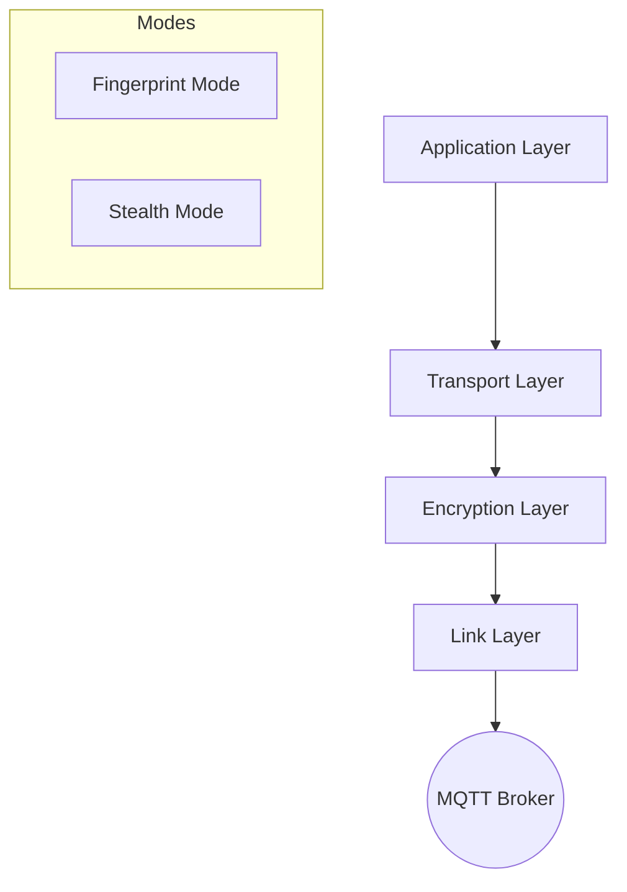

# MQTT Stealth C&C

Covert Command & Control over MQTT, mimicking IoT sensor traffic.

## Architecture

The system supports two distinct communication modes, both operating over MQTT channels (`sensors` topic) to mimic legitimate IoT traffic.



### 1. Fingerprint Mode (`USE_STEALTH_MODE=False`)
- **Mechanism**: Standard AES-256-CBC encryption.
- **Payload**: Encrypted data is placed in a dedicated `fingerprint` field within the JSON sensor packet.
- **Bandwidth**: High (~3.5 KB/s at 1Hz).
- **Security**: Relies on the obscurity of the `fingerprint` field.
- **Pros**: Higher bandwidth, simpler implementation.
- **Cons**: Easier to detect via traffic analysis due to non-standard field.

### 2. Stealth Mode (`USE_STEALTH_MODE=True`)
- **Mechanism**: Steganographic encoding into least significant bits of float values.
- **Payload**: Data is XOR-encrypted and dispersed across standard sensor fields (`temp`, `hum`, `pres`, `light`, `co2`, `noise`).
- **Bandwidth**: Low (~37 B/s at 1Hz).
- **Security**: Highly covert; traffic appears identical to legitimate sensor readings.
- **Pros**: Extremely hard to detect.
- **Cons**: Low bandwidth; requires multiple packets for larger files.

## Configuration

Both **Bot** and **Controller** can be configured via Environment Variables:

| Variable | Default | Description |
|----------|---------|-------------|
| `BROKER` | 147.32.82.209 | MQTT Broker Address |
| `PORT` | 1883 | MQTT Broker Port |
| `TOPIC` | sensors | MQTT Topic |
| `USE_STEALTH_MODE` | True | Enable steganographic mode (True/False) |
| `DEBUG` | True | Enable verbose debug logging (True/False) |

## Deployment

### Bot (target machine)

Required files:
```
bot.py
protocol.py
requirements.txt
```

```bash
pip install -r requirements.txt
python bot.py
```

### Controller (operator machine)

Required files:
```
controller.py
protocol.py
requirements.txt
```

```bash
pip install -r requirements.txt
python controller.py
```

## Commands

| Command | Description |
|---------|-------------|
| `ping` | Check if bots alive |
| `w` | Logged-in users |
| `id` | User ID |
| `ls <dir>` | List directory |
| `exec <cmd>` | Run shell command |
| `copy <file>` | Read file |
| `list` | Show discovered bots |
| `@sensor_XXXX <cmd>` | Target specific bot |

## Tests

Requires MQTT broker on localhost:1883.

```bash
docker run -d -p 1883:1883 eclipse-mosquitto
./venv/bin/python -m pytest test_e2e.py -v
```

### Test Coverage (22 tests)

**Basic Commands**
- ping, w, id, ls, exec return expected output
- Unknown command returns error

**Multiple Bots**
- All 3 bots respond to ping
- Discover multiple bots
- Target specific bot, only that bot responds

**File Copy**
- Small file copy
- Nonexistent file error
- Large file (10KB) with chunking
- Very large file (50KB+) with chunking

**Targeting**
- ALL target received by all bots
- Wrong target ignored

**Protocol Stack**
- Chunk size calculation
- Compression reduces size
- Encrypt/decrypt roundtrip
- Fingerprint size constant for same-size payloads
- Fingerprint size varies with payload size

**Chunking**
- Small message single chunk
- Large response multi-chunk reassembly

## Configuration

| Setting | Value |
|---------|-------|
| Broker | 147.32.82.209 |
| Port | 1883 |
| Topic | sensors |
| Send Interval | 1.0s |
| ID Scan Time | 2.0s |
